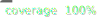

# Koop Provider for ArcGIS Search

Provides a GeoService API to ArcGIS Search for Online and Portal

Build your own Koop provider using [koop-provider-sample](https://github.com/koopjs/koop-provider-sample) or [docs](https://koopjs.github.io/docs/specs/provider/).

## Test it out
Run server:
- `npm install`
- `npm start`

Example API Query:
- `curl localhost:8080/arcgis-search/FeatureServer/0/query?returnCountOnly=true`

Tests:
- `npm test`

### Development output callstack logs

During development you can output error callstack with

- `NODE_ENV=test npm start`

## Deploy to AWS Lambda

Koop providers can be quickly deployed and scaled with AWS Lambda. To first create the service:

- `npm run lambda-create`

To deploy code updates

- `npm run lambda-update`

### AWS Lambda configuration

By default, AWS Lambda has a 3 second timeout and only 128MB memory. If your Koop provider uses a slower service, then you should change the AWS Lambda timeout to a higher time limit (e.g. 60 seconds) as well as add more memory (e.g. 512MB).

## With Docker

- `docker build -t koop-provider-arcgis-search .`
- `docker run -it -p 8080:8080 koop-provider-arcgis-search`

## Publish to npm
- run `npm init` and update the fields
  - Choose a name like `koop-provider-foo`
- run `npm publish`
